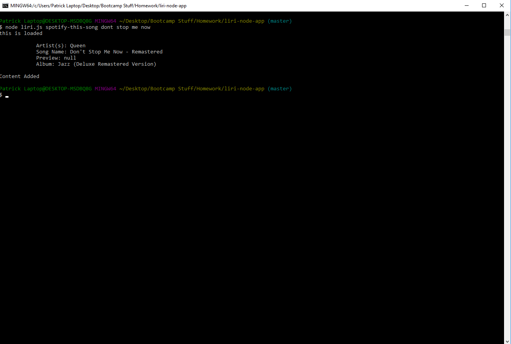
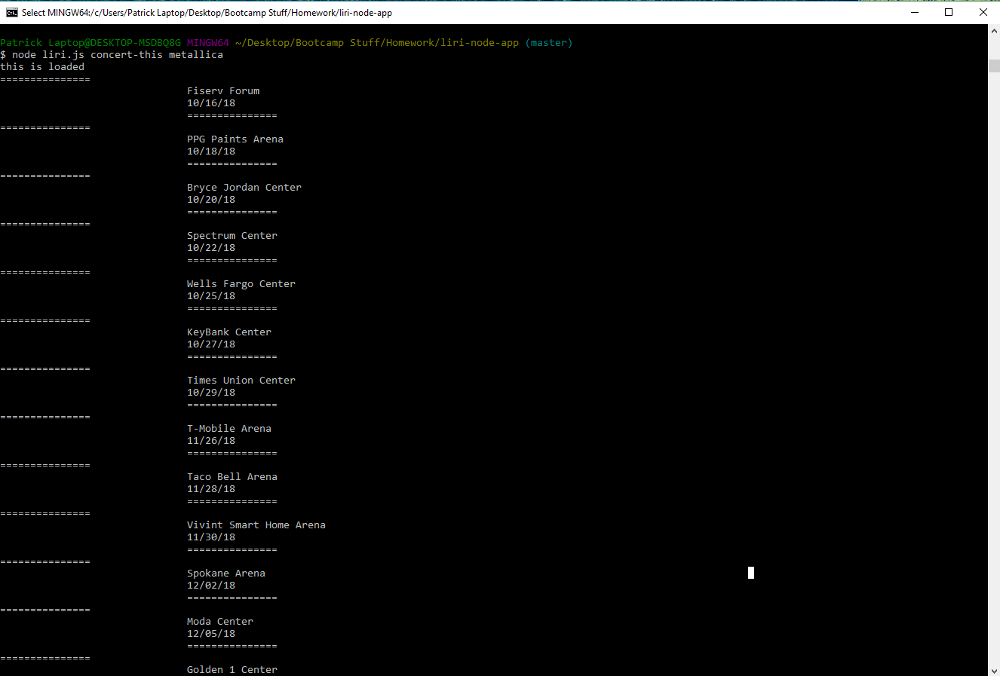
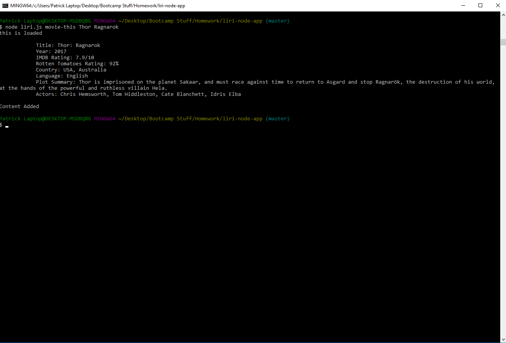
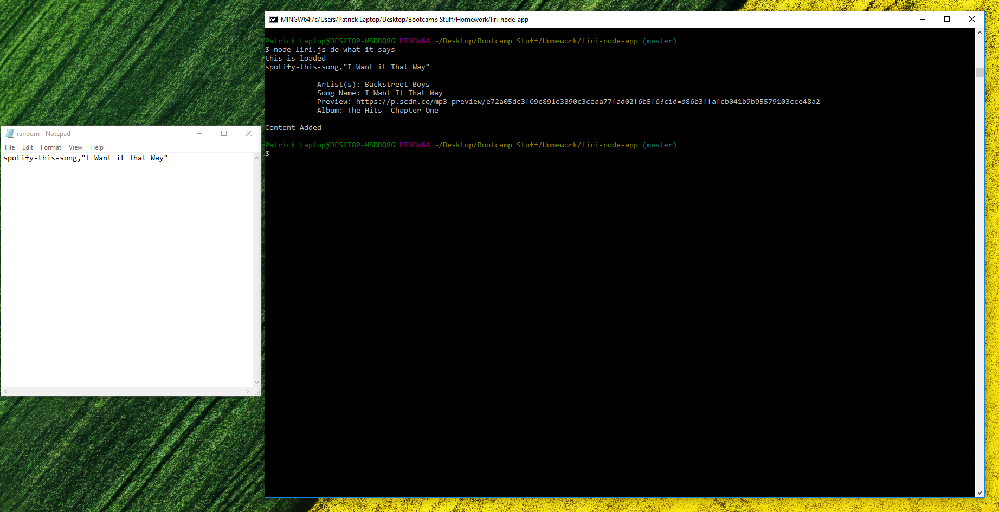

# liri-node-app

A lightweight CLI node application that acts as a simple media assistant.  Liri is capable of looking up and displaying songs, shows, and local concerts, and can take search terms from a .txt file.

### Using the App

Start by navigating to liri-node-app folder on your computer in the terminal, and then type in 

```
node liri.js {command} {search term}

```

There are 4 commands to use LIRI from the CLI:

1.  spotify-this-song

    * Will search spotify for the specified term and return the artist(s) responsible, a song matching the search, a preview link from spotify, and it's album.
    

2.  concert-this

    * Will search for the specified band and return dates and venue locations for events matching the artist
    

3.  movie-this

    * Will search for the specified movie and return the title matching the search, it year, rating, country of origin, languages available, plot, and actors in it.
    

4.  do-what-it-says

    * Will complete the specified search command and query written in the "random.txt" file
    
